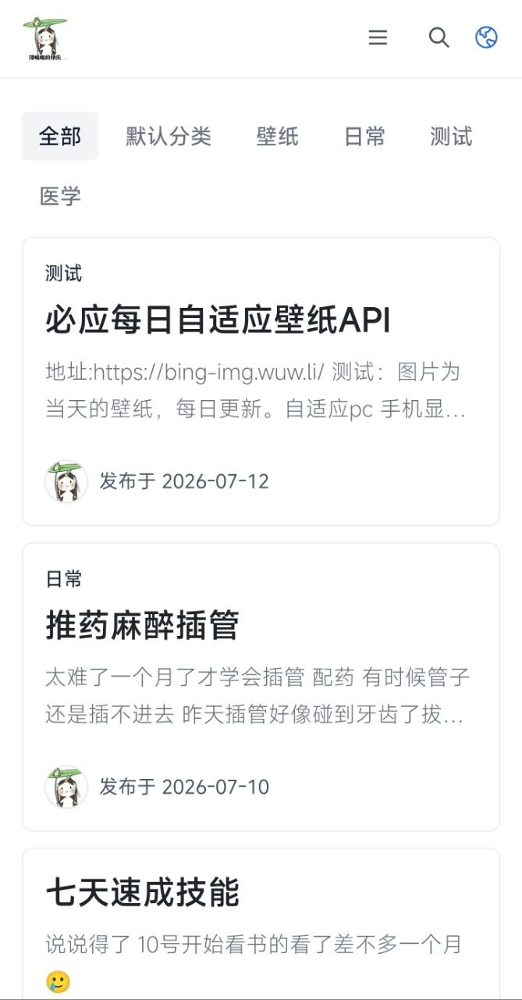

# Earth Minimal

基于官方 Earth 1.16.1 的纯白简洁主题，保持原有页面、插件和后台设置兼容。

## 设计与性能

- 渐进增强式 PJAX 站内导航，连续浏览时避免整页刷新
- 普通文档流导航，不吸顶、不悬浮
- 纯白背景、细分隔线、低阴影和克制圆角
- 默认单列文章列表、无首页大图模块、无文章顶部封面
- 首张列表封面高优先级，其余封面和头像懒加载、异步解码
- 非首屏文章与侧栏组件使用 `content-visibility`
- 不使用 `backdrop-filter`、固定背景或大范围动画
- 自定义样式并入主 CSS，不增加网络请求

## 安装

在 Halo Console 的主题管理中上传 `theme-earth-minimal-1.0.4.zip`，安装并启用。

## 插件支持

Earth 主题支持以下 Halo 插件：

- 友情链接（/links）：<https://www.halo.run/store/apps/app-hfbQg>
- 图库（/photos）：<https://www.halo.run/store/apps/app-BmQJW>
- 瞬间（/moments）：<https://www.halo.run/store/apps/app-SnwWD>

为了获得更好的体验，你还可以安装以下插件（如果需要）：

- Shiki 代码高亮：<https://www.halo.run/store/apps/app-kzloktzn>
- lightgallery.js 灯箱：<https://www.halo.run/store/apps/app-OoggD>

## 基线

- Earth：1.16.1
- Halo：>= 2.22.0
- License：GPL-3.0
